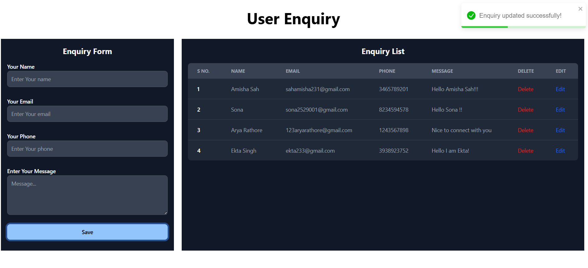

# User Enquiry Project

A fullstack web application for managing user enquiries, built with React (Vite) on the frontend and Node.js/Express with MongoDB on the backend.

---

## Features

- Submit user enquiries via a web form
- View, update, edit and delete enquiries
- Responsive UI with Flowbite React components
- Toast notifications for user feedback
- RESTful API with Express and MongoDB
- Environment variable support for configuration

---

## Project Structure

```
your-project/
├── client/         # Frontend (React + Vite)
│   ├── src/
│   ├── public/
│   ├── assets/
│   ├── .env
│   └── ...
├── server/         # Backend (Node.js + Express)
│   ├── App/
│   ├── .env
│   └── ...
├── README.md
└── ...
```

---

## Getting Started

### 1. Clone the Repository

```sh
git clone https://github.com/yourusername/your-repo-name.git
cd your-repo-name
```

### 2. Setup the Client

```sh
cd client
npm install
# Create a .env file in /client with:
# VITE_API_URL=http://localhost:5000/api/website/enquiry
npm run dev
```

### 3. Setup the Server

```sh
cd server
npm install
# Create a .env file in /server with your MongoDB URI and other secrets:
# MONGODB_URI=your_mongodb_connection_string
# PORT=5000
npm start
```

---

## Usage

- Open your browser and go to `http://localhost:5173` (or the port Vite shows).
- Submit an enquiry using the form.
- Admins can view and manage enquiries.

---

## Environment Variables

**Client (.env):**
```
VITE_API_URL=http://localhost:5000/api/website/enquiry
```

**Server (.env):**
```
MONGODB_URI=your_mongodb_connection_string
PORT=5000
```

---

## Screenshots


---

## Tech Stack

- **Frontend:** React, Vite, Flowbite, Axios, React Toastify
- **Backend:** Node.js, Express, MongoDB, Mongoose, dotenv, CORS

---

## Scripts

**Client:**
- `npm run dev` — Start development server
- `npm run build` — Build for production

**Server:**
- `npm start` — Start server

---

## License

This project is licensed under the MIT License.

---

## Contributing

Pull requests are welcome! For major changes, please open an issue first to discuss what you would like to change.

---
